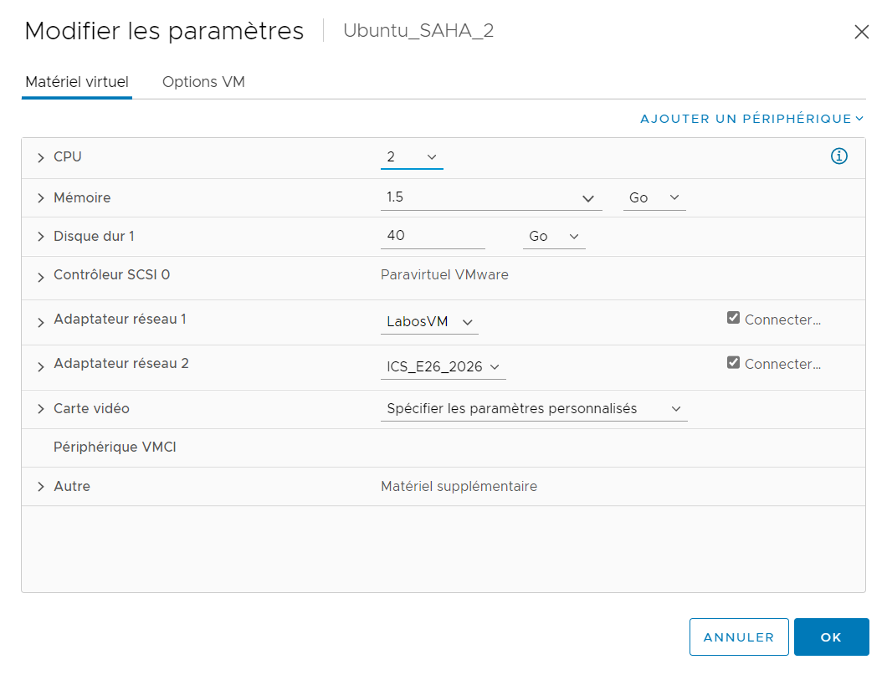

# TP6 - Services réseau


## Exercice 1 : Adressage IP (rappels)

**Vous administrez le réseau interne 172.16.0.0/23 d’une entreprise, et devez gérer un parc de 254 machines réparties en 7 sous-réseaux. La répartition des machines est la suivante :**

- Sous-réseau 1 : 38 machines
- Sous-réseau 2 : 33 machines
- Sous-réseau 3 : 52 machines
- Sous-réseau 4 : 35 machines
- Sous-réseau 5 : 34 machines
- Sous-réseau 6 : 37 machines
- Sous-réseau 7 : 25 machines

**Donnez, pour chaque sous-réseau, l’adresse de sous-réseau, l’adresse de broadcast (multidiffusion) ainsi que les adresses de la première et dernière machine configurées (précisez si vous utilisez du VLSM ou pas).**

J'utilise du VLSM pour calculer 
- Adresse de sous-réseau 3 : 52 machines + @réseau + @brodcast
    - bits nécessaires = 6 (car 2^6 = 64 > 54)
    - masque --> 32 - 6 = 26 --> /26
    - adresse : 172.16.0.0/26
    - première adresse : 172.16.0.1/26
    - dernière adresse : 172.16.0.62/26
    - adresse de brodcast : 172.16.0.63/26
    - plage restante : 172.16.0.64/26

- Adresse de sous-réseau 1 : 38 machines + @réseau + @brodcast
    - bits nécessaires = 6 (car 2^6 = 64 > 40)
    - masque --> 32 - 6 = 26 --> /26
    - adresse : 172.16.0.64/26
    - première adresse : 172.16.0.65/26
    - dernière adresse : 172.16.0.126/26
    - adresse de brodcast : 172.16.0.127/26
    - plage restante : 172.16.0.128/26


- Adresse de sous-réseau 6 : 37 machines + @réseau + @brodcast
    - bits nécessaires = 6 (car 2^6 = 64 > 39)
    - masque --> 32 - 6 = 26 --> /26
    - adresse : 172.16.0.128/26
    - première adresse : 172.16.0.129/26
    - dernière adresse : 172.16.0.190/26
    - adresse de brodcast : 172.16.0.191/26
    - plage restante : 172.16.0.192/26


- Adresse de sous-réseau 4 : 35 machines + @réseau + @brodcast
    - bits nécessaires = 6 (car 2^6 = 64 > 37)
    - masque --> 32 - 6 = 26 --> /26
    - adresse : 172.16.0.192/26
    - première adresse : 172.16.0.193/26
    - dernière adresse : 172.16.0.254/26
    - adresse de brodcast : 172.16.0.255/26
    - plage restante : 172.16.1.0/26


- Adresse de sous-réseau 5 : 34 machines + @réseau + @brodcast
    - bits nécessaires = 6 (car 2^6 = 64 > 36)
    - masque --> 32 - 6 = 26 --> /26
    - adresse : 172.16.1.0/26
    - première adresse : 172.16.1.1/26
    - dernière adresse : 172.16.1.62/26
    - adresse de brodcast : 172.16.1.63/26
    - plage restante : 172.16.1.64/26


- Adresse de sous-réseau 2 : 33 machines + @réseau + @brodcast
    - bits nécessaires = 6 (car 2^6 = 64 > 35)
    - masque --> 32 - 6 = 26 --> /26
    - adresse : 172.16.1.64/26
    - première adresse : 172.16.1.65/26
    - dernière adresse : 172.16.1.126/26
    - adresse de brodcast : 172.16.1.127/26
    - plage restante : 172.16.1.128/26


- Adresse de sous-réseau 7 : 25 machines + @réseau + @brodcast
    - bits nécessaires = 5 (car 2^5 = 32 > 27)
    - masque --> 32 - 5 = 27 --> /27
    - adresse : 172.16.1.128/27
    - première adresse : 172.16.1.129/27
    - dernière adresse : 172.16.1.158/27
    - adresse de brodcast : 172.16.1.159/27
    - plage restante : 172.16.1.160/27

## Exercice 2 :  Préparation de l’environnement

**Dans ce TP nous allons mettre en place un réseau rudimentaire constitué de seulement deux machines :**
**un serveur et un client :**
- le serveur a une connexion Internet, notamment pour télécharger les paquets nécessaires à l’installation des serveurs, et sert de passerelle au client ;
- les deux machines appartiennent à un réseau local ;
- le client a accès à Internet uniquement via le serveur ; il dispose d’une interface réseau qui recevra son adresse IP du serveur DHCP. Dans un premier temps, cette interface sera activée mais débranchée.

1. ***VM éteintes, utilisez les outils de configuration de VirtualBox pour mettre en place l’environnement décrit ci-dessus.***




2. ***Démarrez le serveur et vérifiez que les interfaces réseau sont bien présentes. A quoi correspond l’interface appelée lo ?***

A l'aide de la commande `ifconfig lo` on peut voir que lanterface `lo` correspond à `loopback`, elle possède l'adresse ip par défaut `127.0.0.1`.


3. ***Dans les versions récentes, Ubuntu installe d’office le paquet cloud-init lors de la configuration du système. Ce paquet permet la configuration et le déploiement de machines dans le cloud via un script au démarrage. Nous ne nous en servirons pas et sa présence interfère avec certains services (en particulier le changement de nom d’hôte) ; par ailleurs, vos machines démarreront plus rapidement. Désinstallez complètement ce paquet (il faudra penser à le faire également sur le client ensuite.)***

***A l'aide de la commande `purge` je désinstalle complétement (suppression de paquet et sa config) le paquet cloud-init sur le client et sur le serveur.***

```consol
    User@localhost:~$ sudo apt-get purge cloud-init
```

4. ***Les deux machines serveur et client se trouveront sur le domaine tpadmin.local. A l’aide de la commande hostnamectl renommez le serveur (le changement doit persister après redémarrage, donc cherchez les bonnes options dans le manuel !). On peut afficher le nom et le domaine d’une machine avec les commandes hostname et/ou dnsdomainname ou en affichant le contenu du fichier /etc/hostname.***

***- Il se peut que l’ancien nom persiste dans le fichier /etc/hosts, associé à l’adresse IP 127.0.1.1 ; si c’est le cas, modifiez ce fichier à la main.***
***- ISC DHCP Server utilise le temps UTC, qui diffère de l’heure locale française. C’est pourquoi vous pourrez observer une différence entre la machine virtuelle et la machine hôte.***

```consol
    User@localhost:~$ sudo hostnamectl set-hostname serveur.tpadmin.local
    User@localhost:~$ sudo reboot
```
```consol
    User@serveur:~$ hostname
    serveur.tpadmin.local
```

## Exercice 3. Installation du serveur DHCP

**Un serveur DHCP permet aux ordinateurs clients d’obtenir automatiquement une configuration réseau (adresse IP, serveur DNS, passerelle par défaut…), pour une durée déterminée. Ainsi, dans notre cas, l’interfaces réseau de client doit être configurée automatiquement par serveur. Le réseau local tpadmin.local a pour adresse 192.168.100.0/24 (on aurait pu choisir une autre adresse ; attention, 192.168.1.0/24 est souvent réservée, par exemple par votre FAI).**


1. ***Sur le serveur, installez le paquet `isc-dhcp-server`. La commande `systemctl status isc-dhcp-server` devrait vous indiquer que le serveur n’a pas réussi à démarrer, ce qui est normal puisqu’il n’est pas encore configuré (en particulier, il n’a pas encore d’adresses IP à distribuer).***

```consol
    User@serveur:~$ sudo apt-get install isc-dhcp-server
    User@serveur:~$ systemctl status isc-dhcp-server
```


2. ***Un serveur DHCP a besoin d’une IP statique. Attribuez de manière permanente l’adresse IP 192.168.100.1 à l’interface réseau du réseau interne. Vérifiez que la configuration est correcte.***

```consol
    User@serveur:~$ sudo nano /etc/netplan/50-cloud-init.yaml
```
```consol
    network:
        ethernets:
            ens0s3:
                dhcp4: true
                addresses: [192.168.100.1/24]
        version: 2
```

3. ***La configuration du serveur DHCP se fait via le fichier /etc/dhcp/dhcpd.conf. Faites une sauvegarde du fichier existant sous le nom dhcpd.conf.bak puis éditez le fichier dhcpd.conf avec les informations suivantes :***

```consol
default-lease-time 120;
max-lease-time 600;
authoritative;                                  #DHCP officiel pour notre réseau
option broadcast-address 192.168.100.255;       #informe les clients de l'adresse de broadcast
option domain-name "tpadmin.local";             #tous les hôtes qui se connectent au
                                                #réseau auront ce nom de domaine

subnet 192.168.100.0 netmask 255.255.255.0 {    #configuration du sous-réseau 192.168.100.0
range 192.168.100.100 192.168.100.240;          #pool d'adresses IP attribuables
option routers 192.168.100.1;                   #le serveur sert de passerelle par défaut
option domain-name-servers 192.168.100.1;       #le serveur sert aussi de serveur DNS
}
```

```consol
    User@serveur:~$ sudo cp /etc/dhcp/dhcpd.conf /etc/dhcp/dhcpd.conf.bak
    User@serveur:~$ sudo nano /etc/dhcp/dhcpd.conf
```

***A quoi correspondent les deux premières lignes ?***
***- Les valeurs indiquées sur ces deux lignes sont faibles, afin que l’on puisse voir constituer quelques logs durant ce TP. Dans un environnement de production, elles sont beaucoup plus élevées !***

La première ligne `default-lease-time 120` correspond au temps de location par défaut et la deuxième ligne `max-lease-time 600` correspond au temps maximum de location d'une adresse IP par le serveur DHCP.

4. ***Editez le fichier /etc/default/isc-dhcp-server afin de spécifier l’interface sur laquelle le serveur doit écouter.***

```consol
    User@serveur:~$ sudo nano /etc/default/isc-dhcp-server
    INTERFACESv4="ens0s3"
    INTERFACESv6="ens0s3"
```

5. ***Validez votre fichier de configuration avec la commande `dhcpd -t` puis redémarrez le serveur DHCP (avec la commande `systemctl restart isc-dhcp-server`) et vérifiez qu’il est actif.***

```consol
    User@serveur:~$ sudo dhcpd -t
    User@serveur:~$ sudo systemctl restart isc-dhcp-server
```

6. ***Notre serveur DHCP est configuré ! Passons désormais au client. Si vous avez suivi le sujet du TP 1, le client a été créé en clonant la machine virtuelle du serveur. Par conséquent, son nom d’hôte est toujours serveur. Vérifiez que la carte réseau du client est débranchée, puis démarrez le client (il est possible qu’il mette un certain temps à démarrer : ceci est dû à l’absence de connexion Internet). Comme pour le serveur, désinstallez ensuite `cloud-init`, puis modifiez le nom de la machine (elle doit s’appeler `client.tpadmin.local`).***

```consol
    User@localhost:~$ sudo apt-get purge cloud-init
    User@localhost:~$ sudo hostnamectl set-hostname client.tpadmin.local
    User@localhost:~$ sudo reboot
```

```consol
    User@client:~$ hostname
    client.tpadmin.local
```

***- Pour empêcher la latence au démarrage si une machine n’a pas de connexion Internet, on peut ajouter la ligne optional: true dans son fichier de configuration `/etc/netplan/00-installer-config.yaml`***
***- Il est possible que les commandes sudo prennent désormais un certain temps à s’exécuter sur le client. C’est parce que sudo utilise le fichier `/etc/hosts` qui contient l’ancien nom de la machine. Il faut modifier ce fichier à la main si vous rencontrer ce problème.***

```consol
    User@client:~$ sudo nano etc/hosts
    127.0.0.1 client.tpadmin.local
```

7. ***La commande `tail -f /var/log/syslog` affiche de manière continue les dernières lignes du fichier de log du système (dès qu’une nouvelle ligne est écrite à la fin du fichier, elle est affichée à l’écran). Lancez cette commande sur le `serveur`, puis connectez la carte réseau du `client` et observez les logs sur le serveur. Expliquez à quoi correspondent les messages DHCPDISCOVER, DHCPOFFER, DHCPREQUEST, DHCPACK. Vérifiez que le client reçoit bien une adresse IP de la plage spécifiée précédemment.***

DHCPDISCOVER    = requête du client pour obtenir une adresse IP
DHCPOFFER       = confirmation de réception de la requête au serveur
DHCPREQUEST     = découverte d'une adresse disponible
DHCPACK         = envoi de l'adresse IP au client

8. ***Que contient le fichier `/var/lib/dhcp/dhcpd.leases` sur le serveur, et qu’affiche la commande `dhcp-lease-list` ?***

Sur le serveur, le fichier `/var/lib/dhcp/dhcpd.leases` contient le stockage de la base de données d'attribution client DHCP.
La commande `dhcp-lease-list` permet d'afficher les informations sur les adresses IP attribuées au client par le serveur DHCP.

9. ***Vérifiez que les deux machines peuvent communiquer via leur adresse IP, à l’aide de la commande `ping`.***

```consol
    User@serveur:~$ ping 192.168.100.100
    PING 192.168.100.100 (192.168.100.100) 56(84) bytes of data.
    64 bytes from 192.168.100.100: icmp_seq=1 ttl=64 time=0.237 ms
    64 bytes from 192.168.100.100: icmp_seq=2 ttl=64 time=0.177 ms
    64 bytes from 192.168.100.100: icmp_seq=3 ttl=64 time=0.267 ms
    64 bytes from 192.168.100.100: icmp_seq=4 ttl=64 time=0.316 ms
    64 bytes from 192.168.100.100: icmp_seq=5 ttl=64 time=0.273 ms
```

```consol
    User@client:~$ ping 192.168.100.1
    PING 192.168.100.1 (192.168.100.1) 56(84) bytes of data.
    64 bytes from 192.168.100.1: icmp_seq=1 ttl=64 time=0.345 ms
    64 bytes from 192.168.100.1: icmp_seq=2 ttl=64 time=0.231 ms
    64 bytes from 192.168.100.1: icmp_seq=3 ttl=64 time=0.179 ms
    64 bytes from 192.168.100.1: icmp_seq=4 ttl=64 time=0.265 ms
    64 bytes from 192.168.100.1: icmp_seq=5 ttl=64 time=0.376 ms
```

10. ***Modifiez la configuration du serveur pour que l’interface réseau du client reçoive l’IP statique 192.168.100.20 :***

```consol
deny unknown-clients;   #empêche l'attribution d'une adresse IP à une
                        #station dont l'adresse MAC est inconnue du serveur
host client {
    hardware ethernet XX:XX:XX:XX:XX:XX;    #remplacer par l'adresse MAC
    fixed-address 192.168.100.20;
}
```

```consol
    User@serveur:~$ sudo nano /etc/dhcp/dhcpd.conf
    host client {
        hardware ethernet 00:50:56:89:f7:e8;
        fixed-address 192.168.100.20;
    }
    User@serveur:~$ sudo systemctl restart isc-dhcp-server
```

***Vérifiez que la nouvelle configuration a bien été appliquée sur le client (éventuellement, désactivez puis réactivez l’interface réseau pour forcer le renouvellement du bail DHCP, ou utilisez la commande `dhclient -v`).***

En pingant l'adresse `192.168.100.20` sur le serveur DHCP on remarque que la configuration a bien été appliquée.

```consol
    User@serveur:~$ ping 192.168.100.20
    PING 192.168.100.20 (192.168.100.20) 56(84) bytes of data.
    64 bytes from 192.168.100.20: icmp_seq=1 ttl=64 time=0.255 ms
    64 bytes from 192.168.100.20: icmp_seq=2 ttl=64 time=0.367 ms
    64 bytes from 192.168.100.20: icmp_seq=3 ttl=64 time=0.322 ms
    64 bytes from 192.168.100.20: icmp_seq=4 ttl=64 time=0.177 ms
    64 bytes from 192.168.100.20: icmp_seq=5 ttl=64 time=0.219 ms
    64 bytes from 192.168.100.20: icmp_seq=6 ttl=64 time=0.215 ms
    ^C
    --- 192.168.100.20 ping statistics ---
```

## Exercice 4. Donner un accès à Internet au client

**A ce stade, le client est juste une machine sur notre réseau local, et n’a aucun accès à Internet. Pour remédier à cette situation, on va se servir de la machine serveur (qui, elle, a un accès à Internet via son autre carte réseau) comme d’une passerelle.**

1. ***La première chose à faire est d’autoriser `l’IP forwarding` sur le serveur (désactivé par défaut, étant donné que la plupart des utilisateurs n’en ont pas besoin). Pour cela, il suffit de décommenter la ligne `net.ipv4.ip_forward=1` dans le fichier `/etc/sysctl.conf`. Pour que les changements soient pris en compte immédiatement, il faut saisir la commande `sudo sysctl -p /etc/sysctl.conf`.***
***- Vérifiez avec la commande sysctl net.ipv4.ip_forward que la nouvelle valeur a bien été prise en compte.***

```consol
    User@serveur:~$ sudo nano /etc/sysctl.conf
    net.ipv4.ip_forward = 1
```

```consol
    User@serveur:~$ sudo sysctl -p /etc/sysctl.conf
    User@serveur:~$ sysctl net.ipv4.ip_forward
    net.ipv4.ip_forward = 1
```

2. ***Ensuite, il faut autoriser la traduction d’adresse source (masquerading) en ajoutant la règle iptables suivante :***
`sudo iptables --table nat --append POSTROUTING --out-interface enp0s3 -j MASQUERADE`

```consol
    User@serveur:~$ sudo iptables --table nat --append POSTROUTING --out-interface enp192 -j MASQUERADE
```
***Vérifiez à présent que vous arrivez à « pinguer » une adresse IP (par exemple 1.1.1.1) depuis le client.***

```consol
    User@client:~$ ping 1.1.1.1
    PING 1.1.1.1 (1.1.1.1) 56(84) bytes of data.
    64 bytes from 1.1.1.1: icmp_seq=1 ttl=53 time=8.66 ms
    64 bytes from 1.1.1.1: icmp_seq=2 ttl=53 time=8.79 ms
    64 bytes from 1.1.1.1: icmp_seq=3 ttl=53 time=8.67 ms
    64 bytes from 1.1.1.1: icmp_seq=4 ttl=53 time=9.56 ms
    64 bytes from 1.1.1.1: icmp_seq=5 ttl=53 time=9.45 ms
    64 bytes from 1.1.1.1: icmp_seq=6 ttl=53 time=9.89 ms
    64 bytes from 1.1.1.1: icmp_seq=7 ttl=53 time=8.48 ms
```

***A ce stade, le client a désormais accès à Internet, mais il sera difficile de surfer : par exemple, il est même impossible de pinguer `www.google.com`. C’est parce que nous n’avons pas encore configuré de `serveur DNS` pour le client.***

## Exercice 5. Installation du serveur DNS

**De la même façon qu’il est plus facile de retenir le nom d’un contact plutôt que son numéro de téléphone, il est plus simple de mémoriser le nom d’un hôte sur un réseau (par exemple www.cpe.fr) plutôt que son adresse IP (178.237.111.223).**

**Dans les premiers réseaux, cette correspondance, appelée `résolution de nom`, se faisait via un fichier nommé hosts (présent dans /etc sous Linux 1). L’inconvénient de cette méthode est que lorsqu’un nom ou une adresse IP change, il faut modifier les fichiers hosts de toutes les machines !**

**Par conséquent, avec l’avénement des réseaux à grande échelle, ce système n’était plus viable, et une autre solution, automatisée et centralisée cette fois, a été mise au point : DNS (Domain Name Server). Généralement, le serveur DNS utilisé est soit celui mis à disposition par le fournisseur d’accès à Internet, soit un DNS public (comme celui de Google : 8.8.8.8, ou celui de Cloudflare : 1.1.1.1).**

**Il est aussi très commun d’utiliser un serveur DNS privé, interne à l’organisation, afin de pouvoir résoudre les noms des machines locales. Pour les requêtes extérieures, le serveur DNS privé passe alors la main à un DNS externe.**

**Il existe de nombreux serveurs DNS, mais le plus commun sous UNIX est Bind9 (Berkeley Internet Name Daemon v.9).**

1. ***Sur le serveur, commencez par installer bind9, puis assurez-vous que le service est bien actif.***

```consol
    User@serveur:~$ sudo apt install bind9
```

A l'aide de la commande `sudo systemctl status bind9` on peut voir que le service est bien actif

2. ***A ce stade, Bind n’est pas configuré et ne fait donc pas grand chose. L’une des manières les simples de le configurer est d’en faire un serveur cache : il ne fait rien à part mettre en cache les réponses de serveurs externes à qui il transmet la requête de résolution de nom.***

***- Le binaire (= programme) installé avec le paquet bind9 ne s’appelle ni bind ni bind9 mais `named...`***

***Nous allons donc modifier son fichier de configuration : `/etc/bind/named.conf.options`. Dans ce fichier, décommentez la partie `forwarders`, et à la place de 0.0.0.0, renseignez les IP de DNS publics comme `1.1.1.1` et `8.8.8.8` (en terminant à chaque fois par un point virgule). Redémarrez le serveur bind9.***

```consol
    User@serveur:~$ sudo nano /etc/bind/named.conf.options
    options {
            directory "/var/cache/bind";

            // If there is a firewall between you and nameservers you want
            // to talk to, you may need to fix the firewall to allow multiple
            // ports to talk.  See http://www.kb.cert.org/vuls/id/800113

            // If your ISP provided one or more IP addresses for stable
            // nameservers, you probably want to use them as forwarders.
            // Uncomment the following block, and insert the addresses replacing
            // the all-0s placeholder.

            forwarders {
                    1.1.1.1;
                    8.8.8.8;
            };

            //========================================================================
            // If BIND logs error messages about the root key being expired,
            // you will need to update your keys.  See https://www.isc.org/bind-keys
            //========================================================================
            dnssec-validation auto;

            listen-on-v6 { any; };
    };
```

```consol
    User@serveur:~$ sudo systemctl restart bind9
```

3. ***Sur le client, retentez un ping sur `www.google.fr`. Cette fois ça devrait marcher ! On valide ainsi la configuration du DHCP effectuée précédemment, puisque c’est grâce à elle que le client a trouvé son serveur DNS.***

```consol
    User@client:~$ ping www.google.fr
    PING www.google.fr (216.58.209.227) 56(84) bytes of data.
    64 bytes from par10s29-in-f3.1e100.net (216.58.209.227): icmp_seq=1 ttl=111 time=8.66 ms
    64 bytes from par10s29-in-f3.1e100.net (216.58.209.227): icmp_seq=2 ttl=111 time=8.74 ms
    64 bytes from par10s29-in-f3.1e100.net (216.58.209.227): icmp_seq=3 ttl=111 time=8.49 ms
    64 bytes from par10s29-in-f3.1e100.net (216.58.209.227): icmp_seq=4 ttl=111 time=8.81 ms
    64 bytes from par10s29-in-f3.1e100.net (216.58.209.227): icmp_seq=5 ttl=111 time=8.57 ms
    64 bytes from par10s29-in-f3.1e100.net (216.58.209.227): icmp_seq=6 ttl=111 time=8.77 ms
    64 bytes from par10s29-in-f3.1e100.net (216.58.209.227): icmp_seq=7 ttl=111 time=8.53 ms
    64 bytes from par10s29-in-f3.1e100.net (216.58.209.227): icmp_seq=8 ttl=111 time=8.68 ms
    ^C
    --- www.google.fr ping statistics ---
```

4. ***Sur le client, installez le navigateur en mode texte `lynx` et essayez de surfer sur `fr.wikipedia.org` (bienvenue dans le passé...)***

```consol
    User@client:~$ sudo apt install lynx
    User@client:~$ lynx fr.wikipedia.org
```


## Exercice 6. Configuration du serveur DNS pour la zone tpadmin.local

**L’intérêt d’un serveur DNS privé est principalement de pouvoir résoudre les noms des machines du réseau local. Pour l’instant, il est impossible de pinguer par leur nom client depuis serveur et inversement.**

1. ***Modifiez le fichier `/etc/bind/named.conf.local` et ajoutez les lignes suivantes :***

```consol
zone "tpadmin.local" IN {
    type master;                        // c'est un serveur maître
    file "/etc/bind/db.tpadmin.local";  // lien vers le fichier de définition de zone
};
```

```consol
    User@serveur:~$ sudo nano /etc/bind/named.conf.local
    // Do any local configuration here
    //

    // Consider adding the 1918 zones here, if they are not used in your
    // organization
    //include "/etc/bind/zones.rfc1918";

    zone "tpadmin.local" IN {
        type master;                        // c'est un serveur maître
        file "/etc/bind/db.tpadmin.local";  // lien vers le fichier de définition de zone
```

2. ***Créez une copie appelée `db.tpadmin.local` du fichier `db.local`. Ce fichier est un fichier configuration typique de DNS, constitué d’enregistrements DNS (cf. cours). Dans le nouveau fichier, remplacez toutes les références à localhost par tpadmin.local, et l’adresse 127.0.0.1 par l’adresse IP du serveur.***

***- La ligne `root.tpadmin.local.` indique en fait une adresse mail du responsable technique de cette zone, où le symbole @ est remplacé par le premier point. Attention également à ne pas oublier le point final, qui représente la racine DNS ; on ne le met pas dans les navigateurs, mais il est indispensable dans les fichiers de configuration DNS !***

***- Le champ serial doit être incrémenté à chaque modification du fichier. Généralement, on lui donne pour valeur la date suivie d’un numéro sur deux chiffres, par exemple 2019031401.***

```consol
    User@serveur:~$ cp cp /etc/bind/db.local /etc/bind/db.tpadmin.local
    User@serveur:~$ sudo nano /etc/bind/db.tpadmin.local
    ;
    ; BIND data file for local loopback interface
    ;
    $TTL    604800
    @       IN      SOA     tpadmin.local. root.tpadmin.local. (
                                 2         ; Serial
                            604800         ; Refresh
                             86400         ; Retry
                           2419200         ; Expire
                            604800 )       ; Negative Cache TTL
    ;
    @       IN      NS      tpadmin.local.
    @       IN      A       192.168.100.1
    @       IN      AAAA    ::1
```


3. ***Maintenant que nous avons configuré notre fichier de zone, il reste à configurer le fichier de zone inverse, qui permet de convertir une adresse IP en nom.***

***Commencez par rajouter les lignes suivantes à la fin du fichier named.conf.local :***

```consol
zone "100.168.192.in-addr.arpa" {
    type master;
    file "/etc/bind/db.192.168.100";
};
```

```consol
    User@serveur:~$ sudo nano /etc/bind/named.conf.local
    // Do any local configuration here
    //

    // Consider adding the 1918 zones here, if they are not used in your
    // organization
    //include "/etc/bind/zones.rfc1918";

    zone "tpadmin.local" IN {
        type master;                        // c'est un serveur maître
        file "/etc/bind/db.tpadmin.local";  // lien vers le fichier de définition de zone

    zone "100.168.192.in-addr.arpa" {
        type master;
        file "/etc/bind/db.192.168.100";
```

***Créez ensuite le fichier db.192.168.100 à partir du fichier db.127, et modifiez le de la même manière que le fichier de zone. Sur la dernière ligne, faites correspondre l’adresse IP avec celle du serveur (Attention, il y a un petit piège !).***

```consol
    User@serveur:~$ sudo cp /etc/bind/db.127 /etc/bind/db.192.168.100
    User@serveur:~$ sudo nano /etc/bind/db.192.168.100 
    ;
    ; BIND reverse data file for local loopback interface
    ;
    $TTL    604800
    @       IN      SOA     tpadmin.local. root.tpadmin.local. (
                                 1         ; Serial
                            604800         ; Refresh
                             86400         ; Retry
                           2419200         ; Expire
                            604800 )       ; Negative Cache TTL
    ;
    @       IN      NS      tpadmin.local.
    1.100.168.192       IN      PTR     tpadmin.local.
```

4. ***Utilisez les utilitaires `named-checkconf` et `named-checkzone` pour valider vos fichiers de configuration :***

```consol
    User@serveur:~$ named-checkconf named.conf.local
    User@serveur:~$ named-checkzone tpadmin.local /etc/bind/db.tpadmin.local
    zone tpadmin.local/IN: loaded serial 2
    OK
```

```consol
    User@serveur:~$ named-checkzone 100.168.192.in-addr.arpa /etc/bind/db.192.168.100
    zone 100.168.192.in-addr.arpa/IN: loaded serial 1
    OK
```

Modifiez le fichier `/etc/systemd/resolved.conf` et décommentez la section DNS.

```consol
    User@serveur:~$ sudo nano /etc/systemd/resolved.conf
    
    [Resolve]
    # Some examples of DNS servers which may be used for DNS= and FallbackDNS=:
    # Cloudflare: 1.1.1.1#cloudflare-dns.com 1.0.0.1#cloudflare-dns.com 2606:4700:4700::1111#cloudflare-dns.com 2606:4700:4700::1001#cloudflare-dns.com
    # Google:     8.8.8.8#dns.google 8.8.4.4#dns.google 2001:4860:4860::8888#dns.google 2001:4860:4860::8844#dns.google
    # Quad9:      9.9.9.9#dns.quad9.net 149.112.112.112#dns.quad9.net 2620:fe::fe#dns.quad9.net 2620:fe::9#dns.quad9.net
    DNS=
    FallbackDNS=
    Domains=
    DNSSEC=no
    DNSOverTLS=no
    MulticastDNS=yes
    LLMNR=yes
    Cache=yes
    CacheFromLocalhost=no
    DNSStubListener=yes
    DNSStubListenerExtra=
    ReadEtcHosts=yes
    ResolveUnicastSingleLabel=no
```

5. ***Redémarrer le serveur Bind9. Vous devriez maintenant être en mesure de « pinguer »les différentes machines du réseau.***

```consol
    User@serveur:~$ sudo systemctl restart bind9
```

```consol
    User@client:~$ ping serveur.tpadmin.local
    PING serveur.tpadmin.local (192.168.100.1) 56(84) bytes of data.
    64 bytes from serveur.tpadmin.local (192.168.100.1): icmp_seq=1 ttl=64 time=0.473 ms
    64 bytes from serveur.tpadmin.local (192.168.100.1): icmp_seq=2 ttl=64 time=0.247 ms
    64 bytes from serveur.tpadmin.local (192.168.100.1): icmp_seq=3 ttl=64 time=0.391 ms
    64 bytes from serveur.tpadmin.local (192.168.100.1): icmp_seq=4 ttl=64 time=0.562 ms
    ^C
    --- serveur.tpadmin.local ping statistics ---
```